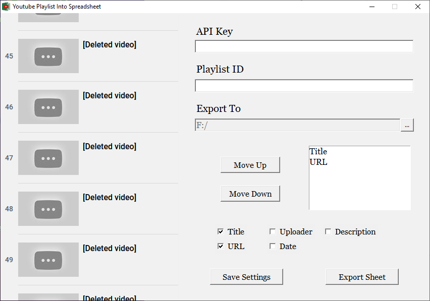

# Youtube-Playlist-Into-Spreadsheet

Export playlist data through Youtube API.

## How to use
Requires a Youtube API Key. If you don't have one, [Youtube has a guide on it](https://developers.google.com/youtube/v3/getting-started#before-you-start). You only need to follow steps 1-3.

The playlist ID is found at the end of the link, like so:
`https://www.youtube.com/playlist?list=[Playlist ID]`

Hitting export will create a file in the specified directory with the filename of the playlist title and current date.
